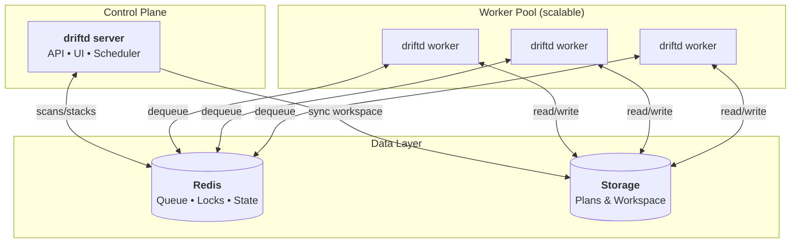

<p align="center">
  <h1 align="center">driftd</h1>
</p>

<p align="center">
  <strong>Continuous drift detection for Terraform & Terragrunt</strong>
</p>

<p align="center">
  <a href="#how-it-works">How It Works</a> &bull;
  <a href="#deployment">Deployment</a> &bull;
  <a href="#configuration">Configuration</a> &bull;
  <a href="#api">API</a>
</p>

---

## What is driftd?

driftd is a read-only drift detection service for Terraform and Terragrunt.
It continuously runs `terraform plan` against your infrastructure and surfaces
drift in a web UI and API. It never applies changes — it is a visibility layer
that fits alongside tools like Atlantis or CI-based applies.

---

## How It Works

```
┌─────────────┐     ┌─────────────┐     ┌─────────────┐     ┌─────────────┐
│   Trigger   │────►│    Sync &   │────►│   Enqueue   │────►│   Workers   │
│ (cron/API)  │     │   Discover  │     │   Stacks    │     │  Run Plans  │
└─────────────┘     └─────────────┘     └─────────────┘     └──────┬──────┘
                                                                   │
                    ┌─────────────┐     ┌─────────────┐            │
                    │   Web UI    │◄────│   Storage   │◄───────────┘
                    │  Dashboard  │     │   (plans)   │
                    └─────────────┘     └─────────────┘
```

1. **Trigger** — Cron schedule, API call, or GitHub webhook initiates a scan
2. **Sync** — Server updates a project workspace snapshot (clone or fetch/reset) and discovers stacks
3. **Enqueue** — One job per stack is added to the Redis queue
4. **Process** — Workers dequeue jobs, run `terraform plan`, save results
5. **Display** — Web UI shows drift status from stored plan outputs

---

## Architecture



| Component | Role |
|-----------|------|
| **serve** | Web UI, REST API, scheduler. Single replica. |
| **worker** | Processes stack scans. Scale horizontally based on workload. |
| **Redis** | Job queue, scan state, project locks. Ephemeral — can be wiped safely. |
| **Storage** | Plan outputs and project workspaces. Mount a PVC for persistence. |

---

## Deployment

**Prerequisites:** A Kubernetes cluster and git credentials for your projects.
Redis can be deployed in-cluster via the Helm chart (default) or provided externally.

### Helm

```bash
helm install driftd ./helm/driftd \
  --set image.repository=ghcr.io/driftdhq/driftd \
  --set image.tag=v0.1.0
```

If your GHCR package is private, create a registry pull secret and set `image.pullSecrets`.

See `helm/driftd/README.md` for full chart documentation.
For external OIDC with oauth2-proxy (Okta/Google/Azure AD), see:
`helm/driftd/examples/oauth2-proxy/`.
For a production baseline values file, see:
`helm/driftd/examples/values-prod-example.yaml`.
For IRSA/workload identity, set `serviceAccount.annotations` in Helm values.

### Quickstart (Minikube)

```bash
minikube start --cpus=4 --memory=6g

kubectl create secret generic driftd-runtime \
  --from-literal=DRIFTD_ENCRYPTION_KEY="$(openssl rand -base64 32)" \
  --dry-run=client -o yaml | kubectl apply -f -

helm upgrade --install driftd ./helm/driftd \
  --set image.repository=ghcr.io/driftdhq/driftd \
  --set image.tag=v0.1.0 \
  --set storage.data.storageClassName=standard \
  --set storage.cache.storageClassName=standard \
  --set config.insecure_dev_mode=true

kubectl port-forward svc/driftd 8080:8080
```

For secure local mode, set `config.insecure_dev_mode=false` and configure
`ui_auth` and/or `api_auth`.

### Image Releases (GHCR)

Image publishing is automated with GitHub Actions on tags that match `v*`.

```bash
git tag v0.1.0
git push origin v0.1.0
```

This publishes:

- `ghcr.io/driftdhq/driftd:v0.1.0`
- `ghcr.io/driftdhq/driftd:sha-<commit>`

### From Source

```bash
git clone https://github.com/driftdhq/driftd.git
cd driftd
go build -o driftd ./cmd/driftd
```

### Kubernetes Layout

- **Server**: Single replica Deployment (runs the scheduler)
- **Workers**: Deployment (HPA optional, based on queue/workload)
- **Redis**: In-cluster subchart by default, or managed Redis/self-hosted
- **Storage**: PVC mounted at `/data` and `/cache`

---

## Configuration

### Minimal Example

```yaml
data_dir: ./data
redis:
  addr: "localhost:6379"
projects:
  - name: my-infra
    url: https://github.com/myorg/terraform-infra.git
```

### Full Example

```yaml
data_dir: ./data
listen_addr: ":8080"

redis:
  addr: "localhost:6379"
  password: ""
  db: 0

worker:
  concurrency: 5      # parallel stack scans per worker process
  lock_ttl: 30m       # project scan lock timeout
  retry_once: true    # retry failed stack scans once
  scan_max_age: 6h    # max scan duration before forced failure
  block_external_data_source: false # set true to block Terraform data "external"

workspace:
  retention: 5            # workspace snapshots to keep per project
  cleanup_after_plan: true # remove terraform/terragrunt artifacts from workspaces

projects:
  - name: my-infra
    url: https://github.com/myorg/terraform-infra.git
    branch: main
    ignore_paths:
      - "**/modules/**"
    schedule: "0 */6 * * *"  # cron expression (optional)
    cancel_inflight_on_new_trigger: true  # cancel older scan on newer trigger
    git:
      type: https
      https_token_env: GIT_TOKEN
```

### Monorepo Projects Example

```yaml
projects:
  - name: infra-monorepo
    url: https://github.com/myorg/infra.git
    branch: main
    projects:
      - name: aws-dev
        path: aws/dev
        schedule: "0 */6 * * *"
      - name: aws-staging
        path: aws/staging
      - name: aws-prod
        path: aws/prod
        ignore_paths:
          - "**/modules/**"
```

When `projects` is set, each project is expanded into an independently scanned unit in the UI/API.

<details>
<summary><b>Git Authentication Options</b></summary>

### SSH

```yaml
git:
  type: ssh
  ssh_key_path: /etc/driftd/ssh/id_ed25519
  ssh_known_hosts_path: /etc/driftd/ssh/known_hosts
```

> **Warning:** Setting `ssh_insecure_ignore_host_key: true` disables host key verification and is vulnerable to MITM attacks. Only use for testing.

### HTTPS Token

```yaml
git:
  type: https
  https_token_env: GIT_TOKEN
  https_username: x-access-token
```

### GitHub App

```yaml
git:
  type: github_app
  github_app:
    app_id: 123456
    installation_id: 12345678
    private_key_path: /etc/driftd/github-app.pem
```

GitHub App tokens are short-lived and can be scoped to read-only access.

</details>

<details>
<summary><b>Webhook Configuration</b></summary>

```yaml
webhook:
  enabled: true
  github_secret: "your-webhook-secret"
  # Optional shared token header (if not using GitHub HMAC)
  # token: "shared-token"
  # token_header: "X-Webhook-Token"
  # max_files: 300
```

driftd listens on `POST /api/webhooks/github`. For push events on the default
branch, it maps changed files to stacks and re-plans only affected stacks.

When `webhook.enabled` is true, you must provide `github_secret` or `token` for authentication.

</details>

<details>
<summary><b>Authentication & Security</b></summary>

### Auth Mode

`auth.mode` controls how requests are authenticated:

```yaml
auth:
  mode: internal # internal | external
```

When `insecure_dev_mode: false`, you must also set `DRIFTD_ENCRYPTION_KEY`
for both `serve` and `worker` processes.
If `/data` already contains encrypted settings, keep the same key (or migrate
data) when redeploying.

### UI Basic Auth

```yaml
ui_auth:
  username: "driftd"
  password: "change-me"
```

### API Auth

```yaml
api_auth:
  username: "driftd"
  password: "change-me"
  # Or use a shared token header
  # token: "shared-api-token"
  # token_header: "X-API-Token"
  # Optional separate write token for mutating API endpoints
  # write_token: "shared-api-write-token"
  # write_token_header: "X-API-Write-Token"
```

### External OIDC/Auth-Proxy Mode

When running behind oauth2-proxy (or another trusted auth proxy), switch to external mode:

```yaml
auth:
  mode: external
  external:
    user_header: X-Auth-Request-User
    email_header: X-Auth-Request-Email
    groups_header: X-Auth-Request-Groups
    groups_delimiter: ","
    default_role: viewer
    roles:
      viewers:
        - platform-viewers
      operators:
        - platform-operators
      admins:
        - platform-admins
```

Role behavior:

- `viewer`: read-only UI/API access.
- `operator`: viewer + can trigger scans.
- `admin`: operator + settings/API admin access.

Security notes:

- External mode trusts proxy headers. Do **not** expose driftd directly to the internet.
- Restrict direct access to driftd pods/service (ClusterIP + network policy).
- Keep `/api/webhooks/github` protected with `webhook.github_secret` or webhook token auth.

### Rate Limiting

```yaml
api:
  rate_limit_per_minute: 60
```

</details>

<details>
<summary><b>Cloud Provider Credentials</b></summary>

driftd does not manage cloud credentials. Terraform runs with whatever credentials you provide:

- **Environment variables**: `AWS_ACCESS_KEY_ID`, `GOOGLE_APPLICATION_CREDENTIALS`, `ARM_*`
- **Mounted config**: `~/.aws/credentials`, `~/.config/gcloud`
- **Workload identity**: EKS IRSA, GKE Workload Identity, Azure Workload Identity

The Helm chart supports `server.envFrom` and `worker.envFrom` for mounting secrets.

</details>

<details>
<summary><b>Version Detection</b></summary>

driftd uses [tfswitch](https://tfswitch.warrensbox.com/) and [tgswitch](https://github.com/warrensbox/tgswitch) to detect versions from:

- `.terraform-version` / `.terragrunt-version` files
- (optional) `DRIFTD_DEFAULT_TERRAFORM_VERSION` / `DRIFTD_DEFAULT_TERRAGRUNT_VERSION` env vars (as a global default)

If a stack has no version file and no default env var is set, driftd uses `terraform`/`terragrunt` from `PATH` (if present).

</details>

---

## API

| Method | Path | Description |
|--------|------|-------------|
| GET | `/` | Dashboard |
| GET | `/projects/{project}` | Project detail |
| GET | `/projects/{project}/stacks/{stack...}` | Stack detail with plan output |
| GET | `/api/health` | Health check |
| GET | `/api/scans/{scanID}` | Scan status |
| GET | `/api/stacks/{stackID...}` | Stack scan status |
| POST | `/api/projects/{project}/scan` | Trigger full project scan |
| POST | `/api/projects/{project}/stacks/{stack...}` | Trigger single stack scan |
| POST | `/api/webhooks/github` | GitHub webhook endpoint |

### Examples

**Trigger a scan:**

```bash
curl -X POST http://localhost:8080/api/projects/my-infra/scan
```

**With API token:**

```bash
curl -X POST \
  -H "X-API-Token: your-token" \
  http://localhost:8080/api/projects/my-infra/scan
```

**Response:**

```json
{
  "scan": {
    "id": "my-infra:1706712345678",
    "status": "running",
    "total": 12,
    "queued": 11,
    "running": 1,
    "completed": 0
  }
}
```

**Conflict (scan already running):**

```json
{
  "error": "Repository scan already in progress",
  "active_scan": { "id": "...", "status": "running", "completed": 140, "total": 500 }
}
```

---

## Caching

Mount `/cache` as a persistent volume:

```
/cache/
├── terraform/
│   ├── plugins/     # TF_PLUGIN_CACHE_DIR - shared providers
│   └── versions/    # tfswitch binary cache
└── terragrunt/
    └── versions/    # tgswitch binary cache

Terragrunt module downloads use a per-plan temp directory under `/tmp/driftd-tg`.
```

Shared providers across stacks, cached binaries, reduced downloads.

---

## Security Model

- **Read-only by design** — driftd never applies changes.
- **Terraform `data "external"` can execute commands during plan** — enable `worker.block_external_data_source: true` to block local uses, and apply strict egress + least-privilege cloud roles.
- **Plan output redaction is best-effort** — treat stored plans as sensitive data. Use filesystem permissions and storage encryption.
- **Restrict API and UI access** — VPN, reverse proxy, or built-in auth.
- **Webhooks should always be authenticated** — HMAC or shared token.

---

## Troubleshooting

- **Project locked**: A scan is still running. Check `/api/scans/{id}` and worker logs.
- **Stacks stuck**: Confirm Redis connectivity and worker health.
- **Missing stacks**: Ensure the project path has `*.tf` or `terragrunt.hcl` in expected locations.
- **Auth errors**: Validate SSH keys, tokens, or GitHub App configuration.

---

## License

MIT
