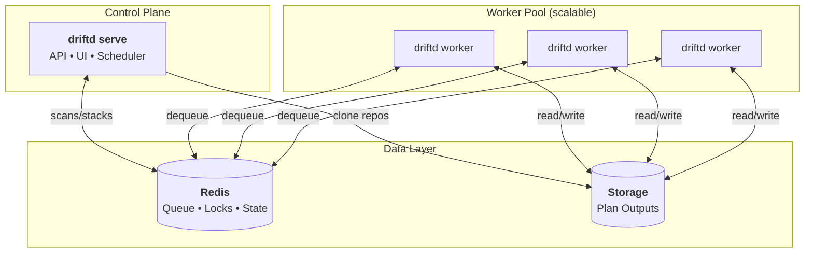

<p align="center">
  <h1 align="center">Driftd</h1>
</p>

<p align="center">
  <strong>Continuous drift detection for Terraform & Terragrunt</strong>
</p>

<p align="center">
  <a href="#quick-start">Quick Start</a> &bull;
  <a href="#features">Features</a> &bull;
  <a href="#how-it-works">How It Works</a> &bull;
  <a href="#configuration">Configuration</a> &bull;
  <a href="#api">API</a>
</p>

---

## What is Driftd?

Driftd is a read-only drift detection service for Terraform and Terragrunt.
It continuously runs `terraform plan` against your infrastructure code and
surfaces drift in a web UI and API. It does **not** apply changes, manage state,
run CI pipelines, or replace Terraform workflows—it is a visibility layer that
fits alongside tools like Atlantis or CI-based applies.

Use Driftd when you want fast, continuous insight into drift across many stacks
and repositories without adding risk to your apply pipeline.

## Quick Mental Model

- **Scan** = one scan of a repo
- **Stack** = one stack plan inside a scan
- **Plan** = output saved to storage and shown in the UI

```
Trigger (cron/API/webhook)
        │
        ▼
     Scan (repo)
        │
        ▼
     Stacks  ──>  Workers run plans  ──>  Storage + UI
```

---

## Quick Start (Docker)

```bash
# 1. Start Redis
docker run -d -p 6379:6379 redis:alpine

# 2. Create config.yaml
cat > config.yaml <<EOF
data_dir: ./data
redis:
  addr: localhost:6379
repos:
  - name: my-infra
    url: https://github.com/myorg/terraform-infra.git
EOF

# 3. Run server + worker
docker run -d -p 8080:8080 \
  -v $(pwd)/config.yaml:/etc/driftd/config.yaml \
  -v driftd-data:/data \
  ghcr.io/driftdhq/driftd serve -config /etc/driftd/config.yaml

docker run -d \
  -v $(pwd)/config.yaml:/etc/driftd/config.yaml \
  -v driftd-data:/data \
  ghcr.io/driftdhq/driftd worker -config /etc/driftd/config.yaml

# 4. Trigger a scan
curl -X POST http://localhost:8080/api/repos/my-infra/scan
```

Open http://localhost:8080 to view the dashboard.

---

## Quick Start (docker-compose)

```yaml
version: "3.8"

services:
  redis:
    image: redis:alpine
    ports:
      - "6379:6379"

  driftd-server:
    image: ghcr.io/driftdhq/driftd:latest
    command: serve -config /etc/driftd/config.yaml
    ports:
      - "8080:8080"
    volumes:
      - ./config.yaml:/etc/driftd/config.yaml
      - driftd-data:/data

  driftd-worker:
    image: ghcr.io/driftdhq/driftd:latest
    command: worker -config /etc/driftd/config.yaml
    volumes:
      - ./config.yaml:/etc/driftd/config.yaml
      - driftd-data:/data

volumes:
  driftd-data:
```

---

## Features

- **Drift Detection** - Runs `terraform plan` or `terragrunt plan` to detect drift
- **Web UI** - Dashboard showing drift status across repositories and stacks
- **Scheduled Scans** - Cron expressions per repository for automated drift checks
- **Webhook Support** - GitHub webhooks for real-time drift updates after applies
- **Version Management** - Auto-detects terraform/terragrunt versions via tfswitch/tgswitch
- **Horizontal Scaling** - Separate server and worker processes for independent scaling
- **Repo Locking** - Prevents concurrent scans of the same repository
- **Caching** - Shared provider and binary cache across workers

---

## How It Works

```
┌─────────────┐     ┌─────────────┐     ┌─────────────┐     ┌─────────────┐
│   Trigger   │────►│   Clone &   │────►│   Enqueue   │────►│   Workers   │
│ (cron/API)  │     │   Discover  │     │   Stacks    │     │  Run Plans  │
└─────────────┘     └─────────────┘     └─────────────┘     └──────┬──────┘
                                                                   │
                    ┌─────────────┐     ┌─────────────┐            │
                    │   Web UI    │◄────│   Storage   │◄───────────┘
                    │  Dashboard  │     │   (plans)   │
                    └─────────────┘     └─────────────┘
```

1. **Trigger** - Cron schedule or API call initiates a scan
2. **Clone** - Server clones the repo and discovers stacks
3. **Enqueue** - One stack scan per stack is added to the Redis queue
4. **Process** - Workers dequeue stack scans, run `terraform plan`, save results
5. **Display** - Web UI shows drift status from stored plan outputs

---

## Example Workflow

A common setup is:

- **Nightly full scans** for every repo (cron).
- **GitHub webhook** on default-branch merges to rescan only affected stacks.

This gives you low-latency drift detection after merges while keeping large
repos manageable by avoiding full scans on every push.

---

## Architecture



| Component | Role |
|-----------|------|
| **serve** | Web UI, REST API, scheduler. Single replica. |
| **worker** | Processes stack scans. Scale horizontally based on workload. |
| **Redis** | Stack scan queue, scan state, repo locks. Ephemeral - can be wiped safely. |
| **Storage** | Plan outputs and drift status. Mount a PVC for persistence. |

---

## Requirements

- **Redis** - For scan state, stack scan queue, and distributed locking
- **Storage** - Filesystem path for plan outputs (PVC in Kubernetes)
- **Git access** - SSH keys, HTTPS tokens, or GitHub App for private repos

Terraform and Terragrunt are auto-installed via tfswitch/tgswitch in the container.

---

## Installation

### From Source

```bash
git clone https://github.com/driftdhq/driftd.git
cd driftd
go build -o driftd ./cmd/driftd
```

### Docker

```bash
docker pull ghcr.io/driftdhq/driftd:latest
```

### Helm

```bash
helm install driftd ./helm/driftd \
  --set image.repository=ghcr.io/driftdhq/driftd \
  --set image.tag=latest
```

See `helm/driftd/README.md` for full chart documentation.

---

## Concepts

| Term | Description |
|------|-------------|
| **Repo** | A git repository containing Terraform or Terragrunt stacks |
| **Scan** | A single scan of a repo. Only one scan can be active per repo. |
| **Stack** | A single stack plan within a scan. Stack scans run in parallel across workers. |
| **Stack** | A directory containing `terragrunt.hcl` or `*.tf` files (ex: `envs/prod`) |

---

## Configuration

### Minimal Example

```yaml
data_dir: ./data
redis:
  addr: "localhost:6379"
repos:
  - name: my-infra
    url: https://github.com/myorg/terraform-infra.git
```

### Full Example

```yaml
data_dir: ./data
listen_addr: ":8080"

redis:
  addr: "localhost:6379"
  password: ""
  db: 0

worker:
  concurrency: 5      # parallel stack scans per worker process
  lock_ttl: 30m       # repo lock timeout
  retry_once: true    # retry failed stack scans once
  scan_max_age: 6h    # max scan duration before forced failure

workspace:
  retention: 5            # workspace snapshots to keep per repo
  cleanup_after_plan: true # remove terraform/terragrunt artifacts from workspaces

repos:
  - name: my-infra
    url: https://github.com/myorg/terraform-infra.git
    branch: main
    ignore_paths:
      - "**/modules/**"
    schedule: "0 */6 * * *"  # cron expression (optional)
    cancel_inflight_on_new_trigger: true  # cancel older scan on newer trigger
    git:
      type: https
      https_token_env: GIT_TOKEN
```

<details>
<summary><b>Git Authentication Options</b></summary>

### SSH

```yaml
git:
  type: ssh
  ssh_key_path: /etc/driftd/ssh/id_ed25519
  ssh_known_hosts_path: /etc/driftd/ssh/known_hosts
```

> **Warning:** Setting `ssh_insecure_ignore_host_key: true` disables host key verification and is vulnerable to MITM attacks. Only use for testing.

### HTTPS Token

```yaml
git:
  type: https
  https_token_env: GIT_TOKEN
  https_username: x-access-token
```

### GitHub App

```yaml
git:
  type: github_app
  github_app:
    app_id: 123456
    installation_id: 12345678
    private_key_path: /etc/driftd/github-app.pem
```

GitHub App tokens are short-lived and can be scoped to read-only access.

</details>

<details>
<summary><b>Webhook Configuration</b></summary>

```yaml
webhook:
  enabled: true
  github_secret: "your-webhook-secret"
  # Optional shared token header (if not using GitHub HMAC)
  # token: "shared-token"
  # token_header: "X-Webhook-Token"
  # max_files: 300
```

Driftd listens on `POST /api/webhooks/github`. For push events on the default
branch, it maps changed files to stacks and re-plans only affected stacks.

When `webhook.enabled` is true, you must provide `github_secret` or `token` for authentication.

</details>

<details>
<summary><b>Authentication & Security</b></summary>

### UI Basic Auth

```yaml
ui_auth:
  username: "driftd"
  password: "change-me"
```

### API Auth

```yaml
api_auth:
  username: "driftd"
  password: "change-me"
  # Or use a shared token header
  # token: "shared-api-token"
  # token_header: "X-API-Token"
```

### Rate Limiting

```yaml
api:
  rate_limit_per_minute: 60
```

</details>

<details>
<summary><b>Cloud Provider Credentials</b></summary>

Driftd does not manage cloud credentials. Terraform runs with whatever credentials you provide:

- **Environment variables**: `AWS_ACCESS_KEY_ID`, `GOOGLE_APPLICATION_CREDENTIALS`, `ARM_*`
- **Mounted config**: `~/.aws/credentials`, `~/.config/gcloud`
- **Workload identity**: EKS IRSA, GKE Workload Identity, Azure Workload Identity

The Helm chart supports `server.envFrom` and `worker.envFrom` for mounting secrets.

</details>

<details>
<summary><b>Version Detection</b></summary>

Driftd uses [tfswitch](https://tfswitch.warrensbox.com/) and [tgswitch](https://github.com/warrensbox/tgswitch) to detect versions from:

- `.terraform-version` / `.terragrunt-version` files
- `required_version` in terraform configuration

If no version is specified, it uses the latest version.

</details>

---

## API

### Routes

| Method | Path | Description |
|--------|------|-------------|
| GET | `/` | Dashboard |
| GET | `/repos/{repo}` | Repository detail |
| GET | `/repos/{repo}/stacks/{stack...}` | Stack detail with plan output |
| GET | `/api/health` | Health check |
| GET | `/api/scans/{scanID}` | Scan status |
| GET | `/api/stacks/{stackID}` | Stack scan status |
| POST | `/api/repos/{repo}/scan` | Trigger full repo scan |
| POST | `/api/repos/{repo}/stacks/{stack...}` | Trigger single stack scan |
| POST | `/api/webhooks/github` | GitHub webhook endpoint |

### Examples

**Trigger a scan:**

```bash
curl -X POST http://localhost:8080/api/repos/my-infra/scan
```

**Trigger a scan with API token:**

```bash
curl -X POST \
  -H "X-API-Token: your-token" \
  http://localhost:8080/api/repos/my-infra/scan
```

**Trigger a scan with basic auth:**

```bash
curl -X POST -u driftd:change-me http://localhost:8080/api/repos/my-infra/scan
```

**Response:**

```json
{
  "scan": {
    "id": "my-infra:1706712345678",
    "status": "running",
    "total": 12,
    "queued": 11,
    "running": 1,
    "completed": 0
  }
}
```

**Conflict (scan already running):**

```json
{
  "error": "Repository scan already in progress",
  "active_scan": { "id": "...", "status": "running", "completed": 140, "total": 500 }
}
```

---

## Caching

Mount `/cache` as a persistent volume:

```
/cache/
├── terraform/
│   ├── plugins/     # TF_PLUGIN_CACHE_DIR - shared providers
│   └── versions/    # tfswitch binary cache
└── terragrunt/
    ├── download/    # TERRAGRUNT_DOWNLOAD - module cache
    └── versions/    # tgswitch binary cache
```

Benefits: shared providers across stacks, cached binaries, reduced downloads.

---

## Data Retention

Plan outputs are stored in `data_dir` and may contain sensitive information.
Use filesystem permissions and storage encryption if needed. Control retention
with `workspace.retention` and by pruning old plan outputs.

---

## Security Model

- Read-only by design: Driftd never applies changes.
- Plan output can include secrets: treat stored plans as sensitive data.
- Restrict API and UI access (VPN, reverse proxy, or built-in auth).
- Webhooks should always be authenticated (HMAC or shared token).

---

## Production Checklist

- Enable `ui_auth` and/or `api_auth`.
- Set `webhook.github_secret` (or `token`) if using webhooks.
- Mount persistent volumes for `/data` and `/cache`.
- Use managed Redis for durability and monitoring.
- Set worker `concurrency` based on Terraform provider rate limits.
- Configure `workspace.retention` to limit disk usage.

---

## Troubleshooting

- **Repo locked**: A scan is still running. Check `/api/scans/{id}` and worker logs.
- **Stacks stuck**: Confirm Redis connectivity and worker health.
- **Missing stacks**: Ensure repo has `*.tf` or `terragrunt.hcl` in expected paths.
- **Auth errors**: Validate SSH keys, tokens, or GitHub App configuration.

---

## Kubernetes Deployment

- **Server**: Single replica Deployment (runs scheduler)
- **Workers**: Deployment with HPA based on queue depth
- **Redis**: Managed Redis (ElastiCache, Memorystore) or self-hosted
- **Storage**: PVC at `/data` and `/cache`

See `helm/driftd/` for the Helm chart.

---

## Contributing

1. Fork the repo and create a feature branch.
2. Run `go test ./...` before submitting.
3. Keep changes focused and include relevant docs updates.

---

## Roadmap

- Authn/Authz (RBAC, team scoping)
- GitHub App enhancements (better mapping, events)
- Per-repo or per-stack policies
- Audit logging and notifications

---

## License

MIT
