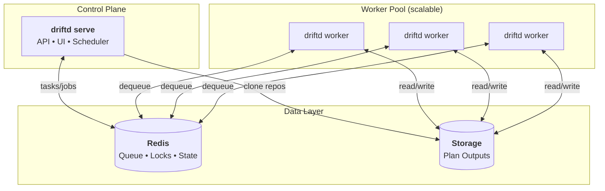

<p align="center">
  <h1 align="center">Driftd</h1>
</p>

<p align="center">
  <strong>Continuous drift detection for Terraform & Terragrunt</strong>
</p>

<p align="center">
  <a href="#quick-start">Quick Start</a> &bull;
  <a href="#features">Features</a> &bull;
  <a href="#architecture">Architecture</a> &bull;
  <a href="#configuration">Configuration</a> &bull;
  <a href="#api">API</a>
</p>

---

## Quick Start

```bash
# 1. Start Redis
docker run -d -p 6379:6379 redis:alpine

# 2. Create config.yaml
cat > config.yaml <<EOF
data_dir: ./data
redis:
  addr: localhost:6379
repos:
  - name: my-infra
    url: https://github.com/myorg/terraform-infra.git
EOF

# 3. Run server + worker
docker run -d -p 8080:8080 \
  -v $(pwd)/config.yaml:/etc/driftd/config.yaml \
  -v driftd-data:/data \
  ghcr.io/cbrown132/driftd serve -config /etc/driftd/config.yaml

docker run -d \
  -v $(pwd)/config.yaml:/etc/driftd/config.yaml \
  -v driftd-data:/data \
  ghcr.io/cbrown132/driftd worker -config /etc/driftd/config.yaml

# 4. Trigger a scan
curl -X POST http://localhost:8080/api/repos/my-infra/scan
```

Open http://localhost:8080 to view the dashboard.

---

## Features

- **Drift Detection** - Runs `terraform plan` or `terragrunt plan` to detect infrastructure drift
- **Web UI** - Dashboard showing drift status across repositories and stacks
- **Scheduled Scans** - Cron expressions per repository for automated drift checks
- **Webhook Support** - GitHub webhooks for real-time drift updates after applies
- **Version Management** - Auto-detects and installs terraform/terragrunt versions via tfswitch/tgswitch
- **Horizontal Scaling** - Separate server and worker processes for independent scaling
- **Repo Locking** - Prevents concurrent scans of the same repository
- **Caching** - Shared provider and binary cache across workers

---

## Architecture



| Component | Role |
|-----------|------|
| **serve** | Web UI, REST API, scheduler. Single replica. |
| **worker** | Processes scan jobs. Scale horizontally based on workload. |
| **Redis** | Job queue, task state, repo locks. Ephemeral - can be wiped safely. |
| **Storage** | Plan outputs and drift status. Mount a PVC for persistence. |

---

## Requirements

- **Redis** - For task state, job queue, and distributed locking
- **Storage** - Filesystem path for plan outputs (PVC in Kubernetes)
- **Git access** - SSH keys, HTTPS tokens, or GitHub App for private repos

Terraform and Terragrunt are auto-installed via tfswitch/tgswitch in the container.

---

## Installation

### From Source

```bash
git clone https://github.com/cbrown132/driftd.git
cd driftd
go build -o driftd ./cmd/driftd
```

### Docker

```bash
docker pull ghcr.io/cbrown132/driftd:latest
```

### Helm

```bash
helm install driftd ./helm/driftd \
  --set image.repository=ghcr.io/cbrown132/driftd \
  --set image.tag=latest
```

See `helm/driftd/README.md` for full chart documentation.

---

## Concepts

| Term | Description |
|------|-------------|
| **Repo** | A git repository containing Terraform or Terragrunt stacks |
| **Task** | A single scan of a repo. Only one task can be active per repo. |
| **Job** | A single stack plan within a task. Jobs run in parallel across workers. |
| **Stack** | A directory containing `terragrunt.hcl` or `*.tf` files |

---

## Configuration

Create a `config.yaml`:

```yaml
data_dir: ./data
listen_addr: ":8080"

redis:
  addr: "localhost:6379"
  password: ""
  db: 0

worker:
  concurrency: 5      # parallel jobs per worker process
  lock_ttl: 30m       # repo lock timeout
  retry_once: true    # retry failed jobs once
  task_max_age: 6h    # max task duration before forced failure

workspace:
  retention: 5        # workspace snapshots to keep per repo

repos:
  - name: my-infra
    url: https://github.com/myorg/terraform-infra.git
    branch: main
    ignore_paths:
      - "**/modules/**"
    schedule: "0 */6 * * *"  # cron expression (optional)
    git:
      type: https
      https_token_env: GIT_TOKEN
```

<details>
<summary><b>Git Authentication Options</b></summary>

### SSH

```yaml
git:
  type: ssh
  ssh_key_path: /etc/driftd/ssh/id_ed25519
  ssh_known_hosts_path: /etc/driftd/ssh/known_hosts
```

> **Warning:** Setting `ssh_insecure_ignore_host_key: true` disables host key verification and is vulnerable to MITM attacks. Only use for testing.

### HTTPS Token

```yaml
git:
  type: https
  https_token_env: GIT_TOKEN
  https_username: x-access-token
```

### GitHub App

```yaml
git:
  type: github_app
  github_app:
    app_id: 123456
    installation_id: 12345678
    private_key_path: /etc/driftd/github-app.pem
```

GitHub App tokens are short-lived and can be scoped to read-only access.

</details>

<details>
<summary><b>Webhook Configuration</b></summary>

```yaml
webhook:
  enabled: true
  github_secret: "your-webhook-secret"
```

Driftd listens on `POST /api/webhooks/github`. For push events on the default branch, it maps changed files to stacks and re-plans only affected stacks.

When `webhook.enabled` is true, you must provide `github_secret` or `token` for authentication.

</details>

<details>
<summary><b>Authentication & Security</b></summary>

### UI Basic Auth

```yaml
ui_auth:
  username: "driftd"
  password: "change-me"
```

### API Auth

```yaml
api_auth:
  username: "driftd"
  password: "change-me"
```

### Rate Limiting

```yaml
api:
  rate_limit_per_minute: 60
```

</details>

<details>
<summary><b>Cloud Provider Credentials</b></summary>

Driftd does not manage cloud credentials. Terraform runs with whatever credentials you provide:

- **Environment variables**: `AWS_ACCESS_KEY_ID`, `GOOGLE_APPLICATION_CREDENTIALS`, `ARM_*`
- **Mounted config**: `~/.aws/credentials`, `~/.config/gcloud`
- **Workload identity**: EKS IRSA, GKE Workload Identity, Azure Workload Identity

The Helm chart supports `server.envFrom` and `worker.envFrom` for mounting secrets.

</details>

<details>
<summary><b>Version Detection</b></summary>

Driftd uses [tfswitch](https://tfswitch.warrensbox.com/) and [tgswitch](https://github.com/warrensbox/tgswitch) to detect versions from:

- `.terraform-version` / `.terragrunt-version` files
- `required_version` in terraform configuration

If no version is specified, it uses the latest version.

</details>

---

## API

### Routes

| Method | Path | Description |
|--------|------|-------------|
| GET | `/` | Dashboard |
| GET | `/repos/{repo}` | Repository detail |
| GET | `/repos/{repo}/stacks/{stack...}` | Stack detail with plan output |
| GET | `/api/health` | Health check |
| GET | `/api/tasks/{taskID}` | Task status |
| GET | `/api/jobs/{jobID}` | Job status |
| POST | `/api/repos/{repo}/scan` | Trigger full repo scan |
| POST | `/api/repos/{repo}/stacks/{stack...}` | Trigger single stack scan |
| POST | `/api/webhooks/github` | GitHub webhook endpoint |

### Examples

**Trigger a scan:**

```bash
curl -X POST http://localhost:8080/api/repos/my-infra/scan
```

**Response:**

```json
{
  "task": {
    "id": "my-infra:1706712345678",
    "status": "running",
    "total": 12,
    "queued": 11,
    "running": 1,
    "completed": 0
  }
}
```

**Conflict (scan already running):**

```json
{
  "error": "Repository scan already in progress",
  "active_task": { "id": "...", "status": "running", "completed": 140, "total": 500 }
}
```

---

## How It Works

```
┌─────────────┐     ┌─────────────┐     ┌─────────────┐     ┌─────────────┐
│   Trigger   │────►│   Clone &   │────►│   Enqueue   │────►│   Workers   │
│ (cron/API)  │     │   Discover  │     │    Jobs     │     │  Run Plans  │
└─────────────┘     └─────────────┘     └─────────────┘     └──────┬──────┘
                                                                   │
                    ┌─────────────┐     ┌─────────────┐            │
                    │   Web UI    │◄────│   Storage   │◄───────────┘
                    │  Dashboard  │     │   (plans)   │
                    └─────────────┘     └─────────────┘
```

1. **Trigger** - Cron schedule or API call initiates a scan
2. **Clone** - Server clones the repo and discovers stacks
3. **Enqueue** - One job per stack is added to the Redis queue
4. **Process** - Workers dequeue jobs, run `terraform plan`, save results
5. **Display** - Web UI shows drift status from stored plan outputs

---

## Caching

Mount `/cache` as a persistent volume:

```
/cache/
├── terraform/
│   ├── plugins/     # TF_PLUGIN_CACHE_DIR - shared providers
│   └── versions/    # tfswitch binary cache
└── terragrunt/
    ├── download/    # TERRAGRUNT_DOWNLOAD - module cache
    └── versions/    # tgswitch binary cache
```

Benefits: shared providers across stacks, cached binaries, reduced downloads.

---

## Kubernetes Deployment

- **Server**: Single replica Deployment (runs scheduler)
- **Workers**: Deployment with HPA based on queue depth
- **Redis**: Managed Redis (ElastiCache, Memorystore) or self-hosted
- **Storage**: PVC at `/data` and `/cache`

See `helm/driftd/` for the Helm chart.

---

## License

MIT
